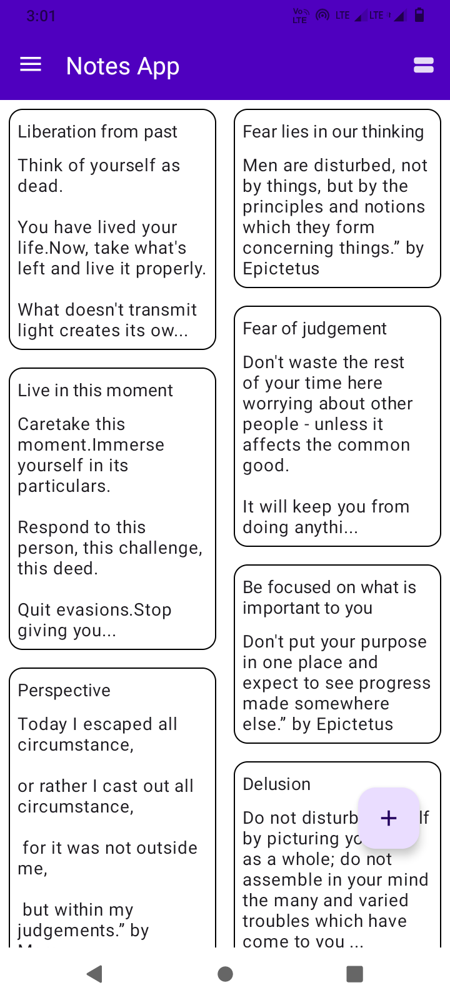
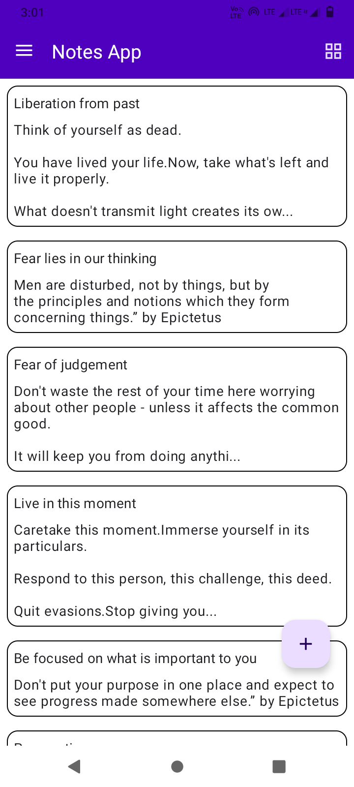
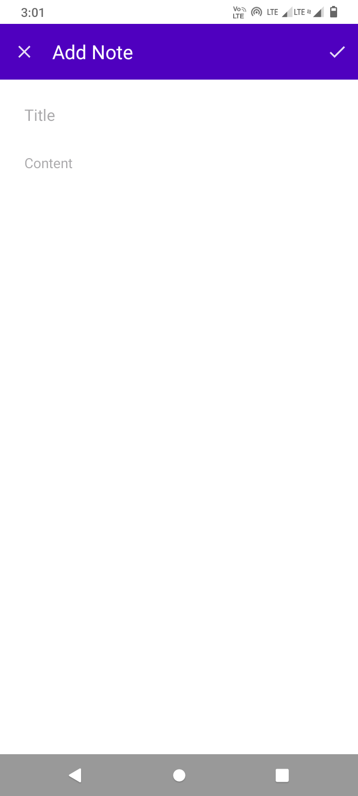
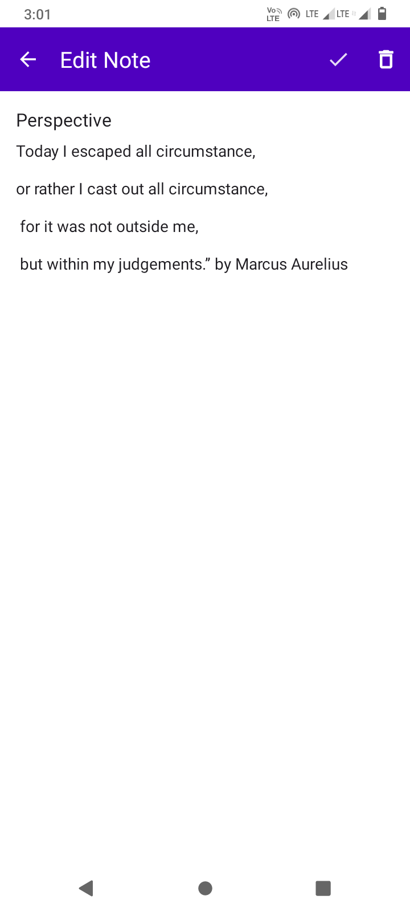
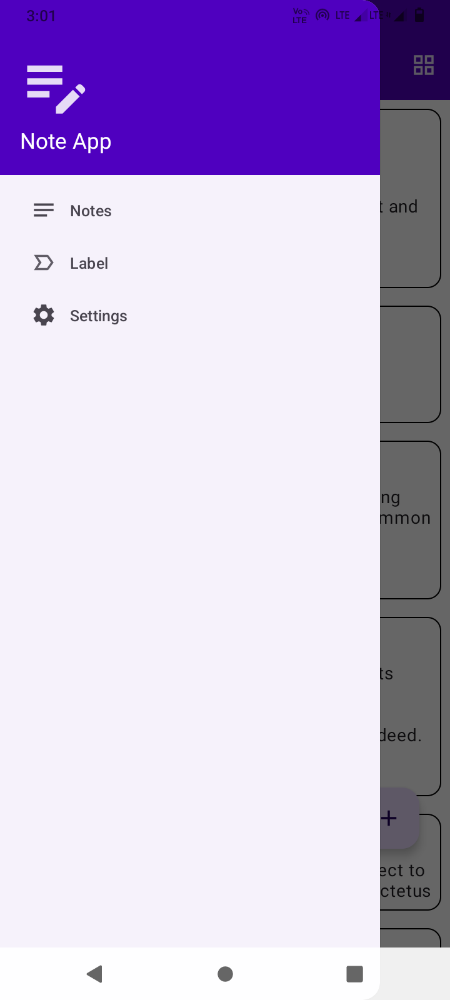
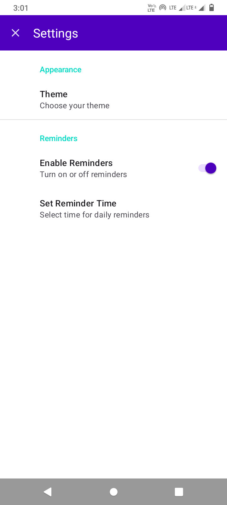

# Note App

This is a simple Note-taking app built for Android using Kotlin and the Room database. The app allows users to efficiently create, edit, delete, and view notes.

## Features
- **Add New Notes:** Users can easily add new notes with a title and content.
- **Edit Notes:** Existing notes can be edited with updated information.
- **Delete Notes:** Users can delete notes that are no longer needed.
- **View Notes:** All notes are displayed in a list, allowing users to view the content quickly.
- **Persistence:** Notes are stored locally using the Room database, ensuring that they are retained even when the app is closed.

## To be implemented  
- **Search Functionality:** Users can search for specific notes by title or content.
- **Label Functionality:** Users can attach a label for specific notes.

## Screenshots

<table>
  <tr>
    <td></td>
    <td></td>
    <td></td>
  </tr>
 
  <tr>
     <td></td>l̥
    <td></td>
     <td></td>
  </tr>

  <tr>
 
  </tr>
</table>
